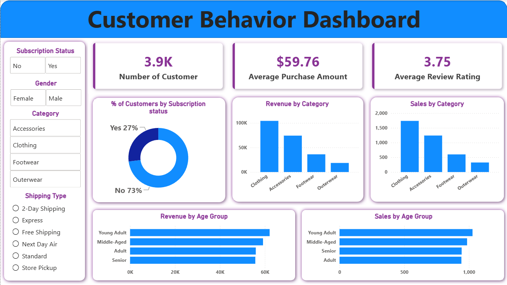

# Customer Shopping Behavior Analysis

## Overview

This project analyzes customer shopping behavior using **Python (Pandas)**, **MySQL**, and **Power BI**. The objective is to clean and explore customer shopping data, answer business questions using SQL, and create an interactive dashboard for data-driven insights.

> **Note:** This project was completed as a guided learning exercise to practice an end-to-end data analytics workflow.

---

## Dataset

The dataset contains customer shopping transactions, including:

- Customer ID
- Age
- Gender
- Item Purchased
- Category
- Purchase Amount
- Location
- Season
- Shipping Type
- Review Rating
- Previous Purchases
- Discount Applied
- Payment Method
- Subscription Status

---

## Tools Used

- Python
- Pandas
- Jupyter Notebook
- MySQL
- Power BI
- Git & GitHub

---

## Project Workflow

### Data Cleaning & EDA (Python)

- Loaded dataset using Pandas
- Checked missing values
- Verified data types
- Explored the dataset
- Prepared data for analysis

### SQL Analysis (MySQL)

Business questions solved include:

- Revenue by gender
- Customer segmentation
- Average purchase amount
- Top-selling products
- Seasonal sales analysis
- Shipping analysis
- Discount analysis
- Product review analysis

### Power BI Dashboard

Created an interactive dashboard including:

- Revenue KPIs
- Category Analysis
- Customer Demographics
- Product Performance
- Seasonal Trends
- Purchase Analysis

---

## Dashboard Preview



---

## Repository Structure

```text
├── Customer_Shopping_Behavior_Analysis.ipynb
├── customer_shopping_behavior.sql
├── customer_shopping_behavior.csv
├── customer_behaviour_dashboard.pbix
├── dashboard.png
└── README.md
```

---

## How to Run

1. Import the dataset into MySQL.
2. Execute the SQL queries.
3. Run the Jupyter Notebook for data exploration.
4. Open the Power BI (.pbix) dashboard.
5. Explore the interactive visualizations.

---

## Learning Outcomes

Through this project, I practiced:

- SQL Query Writing
- Data Cleaning using Pandas
- Exploratory Data Analysis (EDA)
- Power BI Dashboard Development
- Business Data Analysis
- GitHub Project Management

---

## Acknowledgement

This project was completed as a guided learning exercise to strengthen my skills in Python, SQL, and Power BI. The dataset was provided as part of the learning material, while the implementation and analysis were completed for educational purposes.
